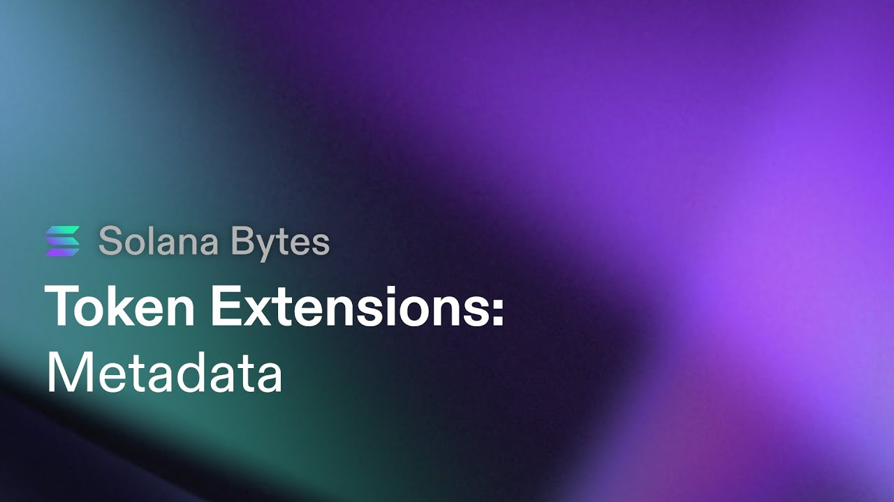

**[Token Metadata with Token Extensions on Solana](https://www.youtube.com/watch?v=l7EyQUlNAdw)**

@00:15 
# Introduction to Using the Metadata Token Extension

In this video, Nick from the **Solana Foundation** Deell team explains how to use the metadata token extension on the new **SPL token** extension program. He demonstrates the process using **VS Code** and provides step-by-step instructions.

## Initializing the Project and Installing Dependencies

- Use `yarn init -y` to initialize a project JSON file.
- Install TypeScript support, Solana Web3JS, SPL token package, token metadata, and Solana Developers Helper package as dependencies.

## Loading Key Pair and Creating Connection

- Load a key pair with devet soul.
- Create a connection to the cluster using devet.
- Use the helper library to load the key pair from the file system.

## Generating a New Random Mint Address

- Generate a new random mint address using `key.generate()`.
- Log out the mint address and payer addresses for verification.

## Filling in Metadata Information

- Create a new object called "metadata" of type TokenMetadata format.
- Fill in required fields such as mint address, name, symbol, and URI (JSON file located off-chain).
- Add additional metadata information as key-value pairs within an array.

## Calculating Mint Space

- Use `getMintLength()` function from SPL token packages to calculate mint space needed for extensions.
- Pass in an array of extensions being used (in this case, only metadata extension).

@05:52
# Conclusion

The tutorial covers initializing a project, installing dependencies, loading key pairs, creating connections, generating random mint addresses, filling in metadata information including additional metadata fields stored on-chain. It also explains how to calculate mint space needed for extensions.

@06:19
# Token Metadata Extension

In this section, the speaker discusses the token metadata extension and its variable extension type. The length and space required on-chain for the metadata depend on the buffer length of the metadata. The URI, name, and symbol are all variable lengths.

## Token Metadata Extension

- The token metadata extension is a variable extension type.
- The length and space needed on-chain depend on the buffer length of the metadata.
- The URI, name, and symbol are all variable lengths.

@06:36
# Calculating Space for Token Extensions

This section explains how to calculate space for token extensions. It mentions that certain constant values come from the SPL token package and act as discriminators. Two bytes each are allocated for type size and length size.

## Calculating Space for Token Extensions

- Space calculation for token extensions differs from other token extensions.
- Constant values from the SPL token package act as discriminators.
- Two bytes each are allocated for type size and length size.

@06:53
# Determining Length of Metadata

Here, it is explained how to determine the actual length of metadata. The pack function from within the SPL token metadata package can be used to obtain this information.

## Determining Length of Metadata

- Use the pack function from within the SPL token metadata package.
- Pass in your metadata object to get the actual on-chain space needed.

@07:28
# Allocating Lamp Ports for Mint

This section discusses allocating lamp ports (minimum balance for rent exemption) for mint creation. By adding together mint space and metadata space, you can determine how many lamp ports are needed.

## Allocating Lamp Ports for Mint

- Add mint space and metadata space to determine the total lamp ports needed.
- This determines the minimum balance for rent exemption.

@08:04
# Building Instructions for Token Creation

Here, the speaker explains how to build instructions for token creation. The first step is to create the account on-chain by initializing it using the system program class.

## Building Instructions for Token Creation

- Create the account on-chain by initializing it using the system program class.
- Use the create account instruction from the system program class.
- Pass in necessary information such as payer pubkey, new account pubkey, mint space, and program ID.

@08:21
# Initializing Metadata and Mint

This section covers initializing metadata and mint. The metadata initialization uses a helper function from the SPL token package. The mint initialization uses another helper function called "create initialize mint."

## Initializing Metadata and Mint

- Initialize metadata using a helper function from the SPL token package.
- Pass in parameters such as mint pubkey, update authority, metadata pointer (which can be set as the mint itself), and token program ID.
- Initialize mint using a helper function called "create initialize mint."
- Pass in parameters such as mint pubkey, number of decimals, mint authority (can be same as payer), and freeze authority if needed.

@12:28
# Initializing the Metadata Account

In this section, we learn about initializing the metadata account using the SPL token metadata package. The instruction for initialization is called "create initialize" and it takes similar parameters to other instructions. We pass in the mint key, metadata account key (which is also the mint key in this case), and optionally, the mint authority.

- The create initialize instruction is used to initialize the metadata account.
- Parameters include the mint key, metadata account key (same as mint key), and optionally, the mint authority.
- We can provide additional metadata information such as name, symbol, URI, program ID, and update authority.

@14:20
# Initializing Onchain Metadata Fields

Here we discuss how to initialize individual onchain metadata fields using separate instructions. We demonstrate how to create an instruction for updating a single field.

- To update individual onchain metadata fields, we use separate instructions.
- We can create an instruction for updating a specific field using "create update field" from SPL token metadata package.
- Parameters include the metadata account key (mint key), program ID (token 22), update authority (same as metadata pointer's payer dopu key).
- Each field has its own index in the additional fields array. We can extract values from our existing additional fields array by specifying their respective indices.

@17:06
# Building Transaction with Instructions

In this section, we learn how to build a transaction with all the necessary instructions and send it to be confirmed on the blockchain.

- We use web3.js library to create a new transaction object.
- All previously created instructions are added to this transaction object using `add` method.
- The order of adding instructions is important; some token extensions need to be initialized before the mint.
- Once the transaction is built, we can send and confirm it using the `sendAndConfirmTransaction` function.
- The function requires a connection object, the transaction itself, and an array of signers (in this case, payer and mint keys).

@18:43
# Sending and Confirming Transaction

Here we discuss how to send and confirm the transaction on the blockchain.

- We use the `sendAndConfirmTransaction` function to send and confirm our transaction.
- The function requires a connection object, the transaction itself, and an array of signers (payer and mint keys).
- After confirmation, we can display the confirmed transaction details.

@19:05
# Logging Out the Signature

In this section, the speaker discusses logging out just the signature.

## Logging Out the Signature

- The transaction needs to be confirmed by the blockchain before using helper functions in the SPL token metadata program.
- To retrieve metadata, you need your connection to the same cluster and the mint address where the metadata is stored.
- Use the `get token metadata` helper function from SPL token metadata program, passing in your connection and mint public key.
- Open up the terminal and run `es run` (or `npxs run` if not installed globally) with your script to display the metadata once it's confirmed by the blockchain.

@20:42
# Conclusion

This section concludes how to use the token metadata extension on the token extension program.