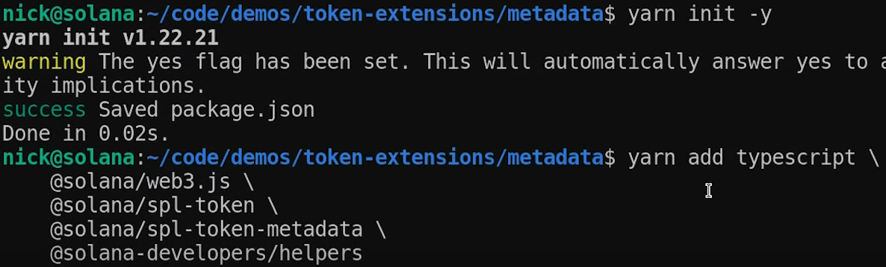

**[Token Metadata with Token Extensions on Solana](https://www.youtube.com/watch?v=l7EyQUlNAdw)**


> Full written guide on the Token Metadata token extension: [**How to use the Metadata Pointer extension | Solana**](https://solana.com/developers/guides/token-extensions/metadata-pointer). > The Token Extensions Program directly implements the SPL Token Metadata Interface, made accessible through the Token Metadata extension. With the Token Metadata extension, the Mint Account itself can now store the metadata directly on the Solana blockchain.

--------
<!-- TOC -->

- [Introduction to Using the Metadata Token Extension](#introduction-to-using-the-metadata-token-extension)
	- [Initializing the Project and Installing Dependencies](#initializing-the-project-and-installing-dependencies)
	- [Loading Key Pair and Creating Connection](#loading-key-pair-and-creating-connection)
	- [Generating a New Random Mint Address](#generating-a-new-random-mint-address)
	- [Filling in Metadata Information](#filling-in-metadata-information)
	- [Calculating Mint Space](#calculating-mint-space)
- [Token Metadata Extension](#token-metadata-extension)
	- [Token Metadata Extension](#token-metadata-extension)
- [Calculating Space for Token Extensions](#calculating-space-for-token-extensions)
	- [Calculating Space for Token Extensions](#calculating-space-for-token-extensions)
- [Determining Length of Metadata](#determining-length-of-metadata)
	- [Determining Length of Metadata](#determining-length-of-metadata)
- [Allocating Lamp Ports for Mint](#allocating-lamp-ports-for-mint)
	- [Allocating Lamp Ports for Mint](#allocating-lamp-ports-for-mint)
- [Building Instructions for Token Creation](#building-instructions-for-token-creation)
	- [Building Instructions for Token Creation](#building-instructions-for-token-creation)
- [Initializing Metadata and Mint](#initializing-metadata-and-mint)
	- [Initializing Metadata and Mint](#initializing-metadata-and-mint)
- [Initializing the Metadata Account](#initializing-the-metadata-account)
- [Initializing Onchain Metadata Fields](#initializing-onchain-metadata-fields)
- [Building Transaction with Instructions](#building-transaction-with-instructions)
- [Sending and Confirming Transaction](#sending-and-confirming-transaction)
- [Logging Out the Signature](#logging-out-the-signature)
- [Conclusion](#conclusion)
- [Transcription](#transcription)

<!-- /TOC -->

--------


[**`00:15`**](https://www.youtube.com/watch?v=l7EyQUlNAdw?t=15)
# Introduction to Using the Metadata Token Extension

In this video, Nick from the **Solana Foundation Developer Team** explains how to use the metadata token extension on the new **SPL token** extension program. He demonstrates the process using **VS Code** and provides step-by-step instructions.

## Initializing the Project and Installing Dependencies




- [**`00:38`**](https://www.youtube.com/watch?v=l7EyQUlNAdw?t=38) Use `yarn init -y` to initialize a project JSON file.
- Install TypeScript support, Solana Web3JS, SPL token package, token metadata, and Solana Developers Helper package as dependencies.

## Loading Key Pair and Creating Connection


- [**`02:00`**](https://www.youtube.com/watch?v=l7EyQUlNAdw?t=120) Load a key pair with devnet sol.
- Create a connection to the cluster using devnet.
- Use the helper library to load the key pair from the file system.

## Generating a New Random Mint Address


- [**`02:29`**](https://www.youtube.com/watch?v=l7EyQUlNAdw?t=149) Generate a new random mint address using `Keypair.generate()`.
- Log out the mint address and payer addresses for verification.

## Filling in Metadata Information


- [**`03:04`**](https://www.youtube.com/watch?v=l7EyQUlNAdw?t=184) Create a new object called "metadata" of type TokenMetadata format.
- [**`03:24`**](https://www.youtube.com/watch?v=l7EyQUlNAdw?t=204) Fill in required fields such as mint address, name, symbol, and URI (JSON file located off-chain).
- [**`04:58`**](https://www.youtube.com/watch?v=l7EyQUlNAdw?t=298) Add additional metadata information as key-value pairs within an array.

## Calculating Mint Space


- [**`05:18`**](https://www.youtube.com/watch?v=l7EyQUlNAdw?t=318) Use `getMintLength()` function from SPL token packages to calculate **mint space needed for extensions**.
- Pass in an array of extensions being used (in this case, only metadata extension).

[**`05:52`**](https://www.youtube.com/watch?v=l7EyQUlNAdw?t=352)

The tutorial covers initializing a project, installing dependencies, loading key pairs, creating connections, generating random mint addresses, filling in metadata information including additional metadata fields stored on-chain. It also explains how to calculate mint space needed for extensions.

[**`06:19`**](https://www.youtube.com/watch?v=l7EyQUlNAdw?t=379)
# Token Metadata Extension

In this section, the speaker discusses the token metadata extension and its variable extension type. The length and space required on-chain for the metadata depend on the buffer length of the metadata. The URI, name, and symbol are all variable lengths.

## Token Metadata Extension

- The token metadata extension is a variable extension type.
- The length and space needed on-chain depend on the buffer length of the metadata.
- The URI, name, and symbol are all variable lengths.

[**`06:36`**](https://www.youtube.com/watch?v=l7EyQUlNAdw?t=396)
# Calculating Space for Token Extensions

This section explains how to calculate space for token extensions. It mentions that certain constant values come from the SPL token package and act as discriminators. Two bytes each are allocated for type size and length size.

## Calculating Space for Token Extensions

```javascript
import { ExtensionType, TYPE_SIZE, LENGTH_SIZE, getMinLen } from "@solan/spl-token";

...

const metadataSpace = TYPE_SIZE + LENGTH_SIZE + ...
```

- [**`06:42`**](https://www.youtube.com/watch?v=l7EyQUlNAdw?t=402) Space calculation for token extensions differs from other token extensions.
- [**`07:08`**](https://www.youtube.com/watch?v=l7EyQUlNAdw?t=428) Constant values from the SPL token package act as discriminators.
- [**`07:23`**](https://www.youtube.com/watch?v=l7EyQUlNAdw?t=443) Two bytes each are allocated for `TYPE_SIZE` and `LENGTH_SIZE`.

[**`06:53`**](https://www.youtube.com/watch?v=l7EyQUlNAdw?t=413)
# Determining Length of Metadata

Here, it is explained how to determine the actual length of metadata. The `pack()` function from within the SPL token metadata package can be used to obtain this information.

## Determining Length of Metadata

```javascript
const metadataSpace = TYPE_SIZE + LENGTH_SIZE + pack(metadata).length
```

- @@07:37 Use the pack function from within the SPL token metadata package.
- Pass in your metadata object to get the actual on-chain space needed.

[**`07:28`**](https://www.youtube.com/watch?v=l7EyQUlNAdw?t=448)
# Allocating Lamp Ports for Mint

This section discusses allocating lampports (*minimum balance for rent exemption*) for mint creation. By adding together mint space and metadata space, you can determine how many lamp ports are needed.

## Allocating Lamp Ports for Mint

```javascript
const metadataSpace = TYPE_SIZE + LENGTH_SIZE + pack(metadata).length

const lamports = await connection.getMinimumBalanceForRentExemption(
    mintspace + metadatSpace
)
```

- [**`08:10`**](https://www.youtube.com/watch?v=l7EyQUlNAdw?t=490) Add mint space and metadata space to determine the total lamp ports needed.
- This determines the minimum balance for rent exemption.

[**`08:04`**](https://www.youtube.com/watch?v=l7EyQUlNAdw?t=484)
# Building Instructions for Token Creation

Here, the speaker explains how to build instructions for token creation. The first step is to create the account on-chain by initializing it using the system program class.

## Building Instructions for Token Creation

```javascript
const createAccountIx = systemProgram.createAccount({
    fromPubKey      : payer.publicKey,
    newAccountPubkey: mint.publicKey,
    lamport         : lamports,
    programId       : TOKEN_2022_PROGRAM_ID  // from `spl-token` package
})
```

- [**`08:27`**](https://www.youtube.com/watch?v=l7EyQUlNAdw?t=507) Create the account on-chain by initializing it using the system program class.
- [**`08:40`**](https://www.youtube.com/watch?v=l7EyQUlNAdw?t=520) Use the `createAccount()` instruction from the system program class.
- [**`10:05`**](https://www.youtube.com/watch?v=l7EyQUlNAdw?t=605) Pass in necessary information such as payer pubkey, new account pubkey, mint space, and program ID.

[**`10:16`**](https://www.youtube.com/watch?v=l7EyQUlNAdw?t=616)
# Initializing Metadata and Mint

This section covers initializing metadata and mint. The metadata initialization uses a helper function from the `spl-token` package. The mint initialization uses another helper function called "create initialize mint."

## Initializing Metadata and Mint

```javascript
const initializeMetadataPointerIx = createInitializeMetadataPointerInstruction({
    mint.publicKey,
    payer.publicKey,
    mint.publicKey,
    TOKEN_2022_PROGRAM_ID
})

const initializeMintIx = createInitializeMintInstruction({
    mint.publicKey,
    2, // decimals
    payer.publicKey,
    null,
})
```

- [**`10:30`**](https://www.youtube.com/watch?v=l7EyQUlNAdw?t=630) **Initialize metadata** using a helper function from the `spl-token` package.
- [**`11:25`**](https://www.youtube.com/watch?v=l7EyQUlNAdw?t=685) Pass in parameters such as mint pubkey, update authority, metadata pointer (which can be set as the mint itself), and token program ID.
- [**`11:35`**](https://www.youtube.com/watch?v=l7EyQUlNAdw?t=695) Initialize mint using a helper function called `createInitializeMintInstruction`.
- [**`12:19`**](https://www.youtube.com/watch?v=l7EyQUlNAdw?t=739) Pass in parameters such as mint pubkey, number of decimals, mint authority (*can be same as payer*), and freeze authority if needed.

[**`12:28`**](https://www.youtube.com/watch?v=l7EyQUlNAdw?t=748)
# Initializing the Metadata Account

[**`12:44`**](https://youtu.be/l7EyQUlNAdw?t=764)
 In this section, we learn about initializing the metadata account using the SPL token metadata package. The instruction for initialization is called "create initialize" and it takes similar parameters to other instructions. We pass in the mint key, metadata account key (which is also the mint key in this case), and optionally, the mint authority.

```javascript
import { TokenMetadata, createInitializeInstruction } from from "@solana/spl-token-metadata";

...

const initializeMetadataIx = createInitializeInstruction({
    mint           : mint.publicKey,
    metadata       : mint.publicKey,
    mintAuthority  : payer.publicKey,
    name           : metadata.name,
    symbol         : metadata.symbol,
    uri            : metadata.uri,
    programId      : TOKEN_2022_PROGRAM_ID,
    updateAuthority: payer.publicKey
});
```

- The create initialize instruction is used to initialize the metadata account.
- Parameters include the mint key, metadata account key (same as mint key), and optionally, the mint authority.
- We can provide additional metadata information such as name, symbol, URI, program ID, and update authority.

[**`14:20`**](https://www.youtube.com/watch?v=l7EyQUlNAdw?t=860)
# Initializing Onchain Metadata Fields

[**`14:40`**](https://www.youtube.com/watch?v=l7EyQUlNAdw?t=880) Here we discuss how to initialize individual onchain metadata fields using separate instructions. We demonstrate how to create an instruction for updating a single field.

```javascript
const updateMetadataField = createUpdateFieldInstruction({
    metadata       : mint.publicKey,
    programId      : TOKEN_2022_PROGRAM_ID,
    updateAuthority: payer.publicKey,
    field          : metadata.additionalMetadata[0][0],
    value          : metadata.additionalMetadata[0][1]
});
```

- To update individual onchain metadata fields, we use separate instructions.
- [**`15:00`**](https://www.youtube.com/watch?v=l7EyQUlNAdw?t=900) We can create an instruction for updating a specific field using `createUpdateFieldInstruction()` from SPL token metadata package.
- Parameters include the metadata account key (mint key), program ID (token 22), update authority (same as metadata pointer's payer dot key).
- [**`16:42`**](https://youtu.be/l7EyQUlNAdw?t=1002) Each field has its own index in the additional fields array. We can extract values from our existing additional fields array by specifying their respective indices.

[**`17:06`**](https://www.youtube.com/watch?v=l7EyQUlNAdw?t=1026)
# Building Transaction with Instructions

In this section, we learn how to build a transaction with all the necessary instructions and send it to be confirmed on the blockchain.

```javascript
const transaction = Transaction().add({
    createAccountIx,
    initializeMetadataPointerIx,
    initializeMintIx,
    initializeMetadataIx,
    updateMetadataField
  });
```

- We use web3.js library to create a new transaction object.
- [**`17:39`**](https://youtu.be/l7EyQUlNAdw?t=1059) All previously created instructions are added to this transaction object using `add()` method.
- [**`17:45`**](https://youtu.be/l7EyQUlNAdw?t=1065) The **order of adding instructions is important**; some token extensions need to be initialized before the mint.
- Once the transaction is built, we can send and confirm it using the `sendAndConfirmTransaction` function.
- The function requires a connection object, the transaction itself, and an array of signers (in this case, payer and mint keys).

[**`18:43`**](https://www.youtube.com/watch?v=l7EyQUlNAdw?t=1123)
# Sending and Confirming Transaction

Here we discuss how to send and confirm the transaction on the blockchain.

```javascript
const sig = await sendAndConfirmRawTransaction(
    connection,
    transaction,
    [payer, mint]
);

console.log("sig:", sig);
```

- We use the `sendAndConfirmRawTransaction()` function to send and confirm our transaction.
- [**`18:51`**](https://youtu.be/l7EyQUlNAdw?t=1131) The function requires a connection object, the transaction itself, and an array of signers (payer and mint keys).
- [**`19:11`**](https://youtu.be/l7EyQUlNAdw?t=1151) After confirmation, we can display the confirmed transaction details.


# Logging Out the Signature

[**`19:16`**](https://www.youtube.com/watch?v=l7EyQUlNAdw?t=1150) In this section, the speaker discusses logging out just the signature.

```javascript
const chainMetada = await getTokenMetadata(
    connection,
    mint.publicKey,
    [payer, mint]
);

console.log(chainMetada);
```


- The transaction needs to be confirmed by the blockchain before using helper functions in the SPL token metadata program.
- To retrieve metadata, you need your connection to the same cluster and the mint address where the metadata is stored.
- [**`19:46`**](https://youtu.be/l7EyQUlNAdw?t=1186) Use the `getTokenMetadata()` helper function from `spl-token'metadata` package, passing in your connection and mint public key.
- [**`20:06`**](https://youtu.be/l7EyQUlNAdw?t=1206) Open up the terminal and run `esrun ./mint.ts` (or `npx esrun` if not installed globally) with your script to display the metadata once it's confirmed by the blockchain.

[**`20:42`**](https://www.youtube.com/watch?v=l7EyQUlNAdw?t=1242)
# Conclusion

This section concludes how to use the token metadata extension on the token extension program.

--------

# Transcription

- [00:00:05](https://www.youtube.com/watch?v=l7EyQUlNAdw?t=5) ➜ hello everyone gmgm I'm Nick from the
- [00:00:07](https://www.youtube.com/watch?v=l7EyQUlNAdw?t=7) ➜ Solana foundation deell team and in this
- [00:00:09](https://www.youtube.com/watch?v=l7EyQUlNAdw?t=9) ➜ video I'm going to go over how to use
- [00:00:10](https://www.youtube.com/watch?v=l7EyQUlNAdw?t=10) ➜ the metadata token extension on the new
- [00:00:12](https://www.youtube.com/watch?v=l7EyQUlNAdw?t=12) ➜ SPL token extension program so you can
- [00:00:15](https://www.youtube.com/watch?v=l7EyQUlNAdw?t=15) ➜ see here I have vs code open I have a
- [00:00:17](https://www.youtube.com/watch?v=l7EyQUlNAdw?t=17) ➜ blank directory there's nothing in here
- [00:00:19](https://www.youtube.com/watch?v=l7EyQUlNAdw?t=19) ➜ and I can go ahead and LS this directory
- [00:00:21](https://www.youtube.com/watch?v=l7EyQUlNAdw?t=21) ➜ nothing comes out so we know it's blank
- [00:00:24](https://www.youtube.com/watch?v=l7EyQUlNAdw?t=24) ➜ so the first thing we're going to do is
- [00:00:25](https://www.youtube.com/watch?v=l7EyQUlNAdw?t=25) ➜ we're going to go ahead and initialize a
- [00:00:26](https://www.youtube.com/watch?v=l7EyQUlNAdw?t=26) ➜ project Json so we're going to use yarn
- [00:00:28](https://www.youtube.com/watch?v=l7EyQUlNAdw?t=28) ➜ knit Dy just to give us the defaults we
- [00:00:31](https://www.youtube.com/watch?v=l7EyQUlNAdw?t=31) ➜ can see our package Json comes open and
- [00:00:33](https://www.youtube.com/watch?v=l7EyQUlNAdw?t=33) ➜ then we're going to go ahead and install
- [00:00:36](https://www.youtube.com/watch?v=l7EyQUlNAdw?t=36) ➜ all of our dependencies so specifically
- [00:00:38](https://www.youtube.com/watch?v=l7EyQUlNAdw?t=38) ➜ I'm going to be adding typescript
- [00:00:40](https://www.youtube.com/watch?v=l7EyQUlNAdw?t=40) ➜ support and Solana web3js the SPL token
- [00:00:43](https://www.youtube.com/watch?v=l7EyQUlNAdw?t=43) ➜ package token metadata and the salon
- [00:00:46](https://www.youtube.com/watch?v=l7EyQUlNAdw?t=46) ➜ developers helper package in order to
- [00:00:47](https://www.youtube.com/watch?v=l7EyQUlNAdw?t=47) ➜ load some key pairs for my file system
- [00:00:50](https://www.youtube.com/watch?v=l7EyQUlNAdw?t=50) ➜ now that all of these have cleared out
- [00:00:52](https://www.youtube.com/watch?v=l7EyQUlNAdw?t=52) ➜ have actually installed we'll go ahead
- [00:00:53](https://www.youtube.com/watch?v=l7EyQUlNAdw?t=53) ➜ and create a new file and we'll just
- [00:00:55](https://www.youtube.com/watch?v=l7EyQUlNAdw?t=55) ➜ name this mint. TS and let's go ahead
- [00:00:58](https://www.youtube.com/watch?v=l7EyQUlNAdw?t=58) ➜ and get to some coding so the first
- [00:01:00](https://www.youtube.com/watch?v=l7EyQUlNAdw?t=60) ➜ thing we're going to need to do is we're
- [00:01:01](https://www.youtube.com/watch?v=l7EyQUlNAdw?t=61) ➜ going to need to load in a key pair that
- [00:01:03](https://www.youtube.com/watch?v=l7EyQUlNAdw?t=63) ➜ has some devnet sol create a connection
- [00:01:04](https://www.youtube.com/watch?v=l7EyQUlNAdw?t=64) ➜ to the cluster itself create our mint
- [00:01:06](https://www.youtube.com/watch?v=l7EyQUlNAdw?t=66) ➜ and then we can actually fill in all the
- [00:01:08](https://www.youtube.com/watch?v=l7EyQUlNAdw?t=68) ➜ metadata we want so the first thing we
- [00:01:09](https://www.youtube.com/watch?v=l7EyQUlNAdw?t=69) ➜ going to do is go ahead and create that
- [00:01:14](https://www.youtube.com/watch?v=l7EyQUlNAdw?t=74) ➜ connection and like I said for this
- [00:01:17](https://www.youtube.com/watch?v=l7EyQUlNAdw?t=77) ➜ connection we're going to connect to
- [00:01:18](https://www.youtube.com/watch?v=l7EyQUlNAdw?t=78) ➜ devnet so we can go ahead and load in the
- [00:01:20](https://www.youtube.com/watch?v=l7EyQUlNAdw?t=80) ➜ cluster URL for devnet and then I'm going
- [00:01:23](https://www.youtube.com/watch?v=l7EyQUlNAdw?t=83) ➜ to load in a payer key pairer that's
- [00:01:24](https://www.youtube.com/watch?v=l7EyQUlNAdw?t=84) ➜ going to actually pay for all the
- [00:01:26](https://www.youtube.com/watch?v=l7EyQUlNAdw?t=86) ➜ transactions and the cost of storage on
- [00:01:28](https://www.youtube.com/watch?v=l7EyQUlNAdw?t=88) ➜ the Solana Network and I'm actually
- [00:01:30](https://www.youtube.com/watch?v=l7EyQUlNAdw?t=90) ➜ going to use the helper library for this
- [00:01:32](https://www.youtube.com/watch?v=l7EyQUlNAdw?t=92) ➜ and I'm going to load in the key pair
- [00:01:35](https://www.youtube.com/watch?v=l7EyQUlNAdw?t=95) ➜ from the file system get key pair from
- [00:01:38](https://www.youtube.com/watch?v=l7EyQUlNAdw?t=98) ➜ file again from the Solana developers
- [00:01:40](https://www.youtube.com/watch?v=l7EyQUlNAdw?t=100) ➜ helper package and I just have to pass
- [00:01:42](https://www.youtube.com/watch?v=l7EyQUlNAdw?t=102) ➜ in a file path here and this is relative
- [00:01:44](https://www.youtube.com/watch?v=l7EyQUlNAdw?t=104) ➜ on my file system now I have the Solana
- [00:01:47](https://www.youtube.com/watch?v=l7EyQUlNAdw?t=107) ➜ CLI installed on my system so I can run
- [00:01:49](https://www.youtube.com/watch?v=l7EyQUlNAdw?t=109) ➜ Solana address and you can see there's
- [00:01:51](https://www.youtube.com/watch?v=l7EyQUlNAdw?t=111) ➜ this Nick b1d address and that's the
- [00:01:52](https://www.youtube.com/watch?v=l7EyQUlNAdw?t=112) ➜ devnet address I'm going use to fund
- [00:01:54](https://www.youtube.com/watch?v=l7EyQUlNAdw?t=114) ➜ everything and I'm just going to load in
- [00:01:56](https://www.youtube.com/watch?v=l7EyQUlNAdw?t=116) ➜ that particular key pair uh using
- [00:01:59](https://www.youtube.com/watch?v=l7EyQUlNAdw?t=119) ➜ JavaScript using the helper and on Linux
- [00:02:02](https://www.youtube.com/watch?v=l7EyQUlNAdw?t=122) ➜ that's located in your home directory so
- [00:02:04](https://www.youtube.com/watch?v=l7EyQUlNAdw?t=124) ➜ tilta sl. config Solana id.
- [00:02:09](https://www.youtube.com/watch?v=l7EyQUlNAdw?t=129) ➜ Json now that we have our payer and
- [00:02:12](https://www.youtube.com/watch?v=l7EyQUlNAdw?t=132) ➜ again this actual address has um some
- [00:02:15](https://www.youtube.com/watch?v=l7EyQUlNAdw?t=135) ➜ devnet sol on it so you can see that I
- [00:02:17](https://www.youtube.com/watch?v=l7EyQUlNAdw?t=137) ➜ don't need to do any aird drops in order
- [00:02:18](https://www.youtube.com/watch?v=l7EyQUlNAdw?t=138) ➜ to do this because I already have devnet
- [00:02:20](https://www.youtube.com/watch?v=l7EyQUlNAdw?t=140) ➜ sol if you don't already have devnet
- [00:02:21](https://www.youtube.com/watch?v=l7EyQUlNAdw?t=141) ➜ sol you can go ahead and do an airdrop
- [00:02:23](https://www.youtube.com/watch?v=l7EyQUlNAdw?t=143) ➜ easy day so next we're going to actually
- [00:02:25](https://www.youtube.com/watch?v=l7EyQUlNAdw?t=145) ➜ generate a new random mint this is going
- [00:02:27](https://www.youtube.com/watch?v=l7EyQUlNAdw?t=147) ➜ to be the mint address that our uh new
- [00:02:30](https://www.youtube.com/watch?v=l7EyQUlNAdw?t=150) ➜ mint that we're going to create our new
- [00:02:31](https://www.youtube.com/watch?v=l7EyQUlNAdw?t=151) ➜ token mint is going to actually hold so
- [00:02:34](https://www.youtube.com/watch?v=l7EyQUlNAdw?t=154) ➜ new key payer or key.
- [00:02:36](https://www.youtube.com/watch?v=l7EyQUlNAdw?t=156) ➜ generate and just for the sake of
- [00:02:38](https://www.youtube.com/watch?v=l7EyQUlNAdw?t=158) ➜ logging this out we'll go ahead and log
- [00:02:40](https://www.youtube.com/watch?v=l7EyQUlNAdw?t=160) ➜ it to the console just to show that the
- [00:02:42](https://www.youtube.com/watch?v=l7EyQUlNAdw?t=162) ➜ we have addresses here so mint dot key.
- [00:02:45](https://www.youtube.com/watch?v=l7EyQUlNAdw?t=165) ➜ 2 base
- [00:02:50](https://www.youtube.com/watch?v=l7EyQUlNAdw?t=170) ➜ 58 and then we'll go ahead and do the
- [00:02:52](https://www.youtube.com/watch?v=l7EyQUlNAdw?t=172) ➜ same thing for our payer just to log out
- [00:02:54](https://www.youtube.com/watch?v=l7EyQUlNAdw?t=174) ➜ those addresses so the next thing we're
- [00:02:55](https://www.youtube.com/watch?v=l7EyQUlNAdw?t=175) ➜ going to want is we're going to actually
- [00:02:56](https://www.youtube.com/watch?v=l7EyQUlNAdw?t=176) ➜ start filling in all the metadata we're
- [00:02:58](https://www.youtube.com/watch?v=l7EyQUlNAdw?t=178) ➜ going to want to put in into our
- [00:03:00](https://www.youtube.com/watch?v=l7EyQUlNAdw?t=180) ➜ metadata token extension so we'll go
- [00:03:02](https://www.youtube.com/watch?v=l7EyQUlNAdw?t=182) ➜ ahead and create a new object call it
- [00:03:04](https://www.youtube.com/watch?v=l7EyQUlNAdw?t=184) ➜ metadata and we're actually going to
- [00:03:06](https://www.youtube.com/watch?v=l7EyQUlNAdw?t=186) ➜ type this to the Token metadata format
- [00:03:10](https://www.youtube.com/watch?v=l7EyQUlNAdw?t=190) ➜ the interface that comes with the SPL
- [00:03:12](https://www.youtube.com/watch?v=l7EyQUlNAdw?t=192) ➜ token metadata package and you can see
- [00:03:14](https://www.youtube.com/watch?v=l7EyQUlNAdw?t=194) ➜ we already have our type error because
- [00:03:15](https://www.youtube.com/watch?v=l7EyQUlNAdw?t=195) ➜ we don't have all the required
- [00:03:16](https://www.youtube.com/watch?v=l7EyQUlNAdw?t=196) ➜ information filled in and you can see
- [00:03:18](https://www.youtube.com/watch?v=l7EyQUlNAdw?t=198) ➜ here with uh vs code I can see all of
- [00:03:21](https://www.youtube.com/watch?v=l7EyQUlNAdw?t=201) ➜ the required fields that we need so we
- [00:03:22](https://www.youtube.com/watch?v=l7EyQUlNAdw?t=202) ➜ have our mint address our name symbol
- [00:03:24](https://www.youtube.com/watch?v=l7EyQUlNAdw?t=204) ➜ URI and then some additional information
- [00:03:26](https://www.youtube.com/watch?v=l7EyQUlNAdw?t=206) ➜ here so we'll start with the basics
- [00:03:28](https://www.youtube.com/watch?v=l7EyQUlNAdw?t=208) ➜ we'll put in our mint here and
- [00:03:29](https://www.youtube.com/watch?v=l7EyQUlNAdw?t=209) ➜ specifically this is looking for the
- [00:03:31](https://www.youtube.com/watch?v=l7EyQUlNAdw?t=211) ➜ mint key pair or sorry the public key
- [00:03:34](https://www.youtube.com/watch?v=l7EyQUlNAdw?t=214) ➜ and then we'll give it a name and in
- [00:03:35](https://www.youtube.com/watch?v=l7EyQUlNAdw?t=215) ➜ this case I'm just going to call this token
- [00:03:38](https://www.youtube.com/watch?v=l7EyQUlNAdw?t=218) ➜ opos and give it a symbol also
- [00:03:43](https://www.youtube.com/watch?v=l7EyQUlNAdw?t=223) ➜ oppos in fact I'll go ahead and update
- [00:03:45](https://www.youtube.com/watch?v=l7EyQUlNAdw?t=225) ➜ this to uh only possible on
- [00:03:49](https://www.youtube.com/watch?v=l7EyQUlNAdw?t=229) ➜ solada and the last required piece of
- [00:03:51](https://www.youtube.com/watch?v=l7EyQUlNAdw?t=231) ➜ information that we actually need is our
- [00:03:53](https://www.youtube.com/watch?v=l7EyQUlNAdw?t=233) ➜ Ur now this URI is typical Json file
- [00:03:57](https://www.youtube.com/watch?v=l7EyQUlNAdw?t=237) ➜ that's going to be located offchain so
- [00:03:59](https://www.youtube.com/watch?v=l7EyQUlNAdw?t=239) ➜ in our case I'm just going to load in
- [00:04:01](https://www.youtube.com/watch?v=l7EyQUlNAdw?t=241) ➜ this uh metadata Json file that's stored
- [00:04:04](https://www.youtube.com/watch?v=l7EyQUlNAdw?t=244) ➜ within the salon developers oost assets
- [00:04:07](https://www.youtube.com/watch?v=l7EyQUlNAdw?t=247) ➜ it's just a generic Json file has some
- [00:04:09](https://www.youtube.com/watch?v=l7EyQUlNAdw?t=249) ➜ information in it that way the Explorers
- [00:04:11](https://www.youtube.com/watch?v=l7EyQUlNAdw?t=251) ➜ will actually be able to display some
- [00:04:12](https://www.youtube.com/watch?v=l7EyQUlNAdw?t=252) ➜ information now the last thing that
- [00:04:14](https://www.youtube.com/watch?v=l7EyQUlNAdw?t=254) ➜ we're going to need within here is we
- [00:04:17](https://www.youtube.com/watch?v=l7EyQUlNAdw?t=257) ➜ need this additional metadata field now
- [00:04:21](https://www.youtube.com/watch?v=l7EyQUlNAdw?t=261) ➜ this is required to be an array by
- [00:04:22](https://www.youtube.com/watch?v=l7EyQUlNAdw?t=262) ➜ default and we have to initialize it as
- [00:04:24](https://www.youtube.com/watch?v=l7EyQUlNAdw?t=264) ➜ a blank array but this is actually one
- [00:04:27](https://www.youtube.com/watch?v=l7EyQUlNAdw?t=267) ➜ of the really cool things about token
- [00:04:28](https://www.youtube.com/watch?v=l7EyQUlNAdw?t=268) ➜ metadata and specifically the token
- [00:04:30](https://www.youtube.com/watch?v=l7EyQUlNAdw?t=270) ➜ metadata extension on the token
- [00:04:33](https://www.youtube.com/watch?v=l7EyQUlNAdw?t=273) ➜ extension program is that this
- [00:04:35](https://www.youtube.com/watch?v=l7EyQUlNAdw?t=275) ➜ additional metadata is actually stored
- [00:04:37](https://www.youtube.com/watch?v=l7EyQUlNAdw?t=277) ➜ on chain it's an account State on The
- [00:04:38](https://www.youtube.com/watch?v=l7EyQUlNAdw?t=278) ➜ Solana Ledger so that way you can
- [00:04:40](https://www.youtube.com/watch?v=l7EyQUlNAdw?t=280) ➜ actually use the blockchain to access
- [00:04:42](https://www.youtube.com/watch?v=l7EyQUlNAdw?t=282) ➜ any and all of this metadata you have in
- [00:04:44](https://www.youtube.com/watch?v=l7EyQUlNAdw?t=284) ➜ here so it's pretty cool so we'll fill
- [00:04:46](https://www.youtube.com/watch?v=l7EyQUlNAdw?t=286) ➜ in a couple of bits of information and
- [00:04:48](https://www.youtube.com/watch?v=l7EyQUlNAdw?t=288) ➜ this takes a each of these uh data
- [00:04:51](https://www.youtube.com/watch?v=l7EyQUlNAdw?t=291) ➜ pieces of data within this additional
- [00:04:53](https://www.youtube.com/watch?v=l7EyQUlNAdw?t=293) ➜ metadata attribute here it's just a key
- [00:04:56](https://www.youtube.com/watch?v=l7EyQUlNAdw?t=296) ➜ value uh key value pair so we need our
- [00:04:59](https://www.youtube.com/watch?v=l7EyQUlNAdw?t=299) ➜ key here and our value here you could
- [00:05:02](https://www.youtube.com/watch?v=l7EyQUlNAdw?t=302) ➜ put any number of bits of information in
- [00:05:04](https://www.youtube.com/watch?v=l7EyQUlNAdw?t=304) ➜ here you want you are going to have to
- [00:05:06](https://www.youtube.com/watch?v=l7EyQUlNAdw?t=306) ➜ pay for that rent when you actually
- [00:05:07](https://www.youtube.com/watch?v=l7EyQUlNAdw?t=307) ➜ create your mint but uh you know with a
- [00:05:09](https://www.youtube.com/watch?v=l7EyQUlNAdw?t=309) ➜ script like this super easy to do so now
- [00:05:12](https://www.youtube.com/watch?v=l7EyQUlNAdw?t=312) ➜ that we have our metadata actually set
- [00:05:13](https://www.youtube.com/watch?v=l7EyQUlNAdw?t=313) ➜ up we can go ahead and start doing all
- [00:05:15](https://www.youtube.com/watch?v=l7EyQUlNAdw?t=315) ➜ of the token extension magic here so
- [00:05:17](https://www.youtube.com/watch?v=l7EyQUlNAdw?t=317) ➜ we're going to need to get a couple of
- [00:05:18](https://www.youtube.com/watch?v=l7EyQUlNAdw?t=318) ➜ bits of information and specifically we
- [00:05:20](https://www.youtube.com/watch?v=l7EyQUlNAdw?t=320) ➜ need to know how much space we need to
- [00:05:22](https://www.youtube.com/watch?v=l7EyQUlNAdw?t=322) ➜ allocate on the Solana blockchain in
- [00:05:23](https://www.youtube.com/watch?v=l7EyQUlNAdw?t=323) ➜ order to actually use this extension so
- [00:05:26](https://www.youtube.com/watch?v=l7EyQUlNAdw?t=326) ➜ we're going to go ahead and figure out
- [00:05:29](https://www.youtube.com/watch?v=l7EyQUlNAdw?t=329) ➜ what are mint space is going to be so
- [00:05:32](https://www.youtube.com/watch?v=l7EyQUlNAdw?t=332) ➜ let's get our mint space and we actually
- [00:05:35](https://www.youtube.com/watch?v=l7EyQUlNAdw?t=335) ➜ can use some of the helper functions
- [00:05:36](https://www.youtube.com/watch?v=l7EyQUlNAdw?t=336) ➜ within the token extension packages or
- [00:05:38](https://www.youtube.com/watch?v=l7EyQUlNAdw?t=338) ➜ sorry the SPL token packages and this
- [00:05:41](https://www.youtube.com/watch?v=l7EyQUlNAdw?t=341) ➜ helper function is called get min length
- [00:05:44](https://www.youtube.com/watch?v=l7EyQUlNAdw?t=344) ➜ uh sorry get mint length and this
- [00:05:46](https://www.youtube.com/watch?v=l7EyQUlNAdw?t=346) ➜ actually passes in an array of all the
- [00:05:49](https://www.youtube.com/watch?v=l7EyQUlNAdw?t=349) ➜ extensions that we're going to be using
- [00:05:51](https://www.youtube.com/watch?v=l7EyQUlNAdw?t=351) ➜ on this particular mint that we're
- [00:05:53](https://www.youtube.com/watch?v=l7EyQUlNAdw?t=353) ➜ creating in this particular case we're
- [00:05:55](https://www.youtube.com/watch?v=l7EyQUlNAdw?t=355) ➜ actually only going to be using the
- [00:05:56](https://www.youtube.com/watch?v=l7EyQUlNAdw?t=356) ➜ metadata extension so when we have to so
- [00:06:00](https://www.youtube.com/watch?v=l7EyQUlNAdw?t=360) ➜ when we are calculating our mint space
- [00:06:02](https://www.youtube.com/watch?v=l7EyQUlNAdw?t=362) ➜ we just need the metadata pointer
- [00:06:04](https://www.youtube.com/watch?v=l7EyQUlNAdw?t=364) ➜ because this bit of information is going
- [00:06:05](https://www.youtube.com/watch?v=l7EyQUlNAdw?t=365) ➜ to be stored on chain it's stored on the
- [00:06:07](https://www.youtube.com/watch?v=l7EyQUlNAdw?t=367) ➜ mint itself so the next bit of
- [00:06:09](https://www.youtube.com/watch?v=l7EyQUlNAdw?t=369) ➜ information is we actually need to
- [00:06:10](https://www.youtube.com/watch?v=l7EyQUlNAdw?t=370) ➜ figure out how much space our metadata
- [00:06:13](https://www.youtube.com/watch?v=l7EyQUlNAdw?t=373) ➜ is going to take so let's go ahead and
- [00:06:15](https://www.youtube.com/watch?v=l7EyQUlNAdw?t=375) ➜ calculate that
- [00:06:18](https://www.youtube.com/watch?v=l7EyQUlNAdw?t=378) ➜ now and with the token metadata
- [00:06:21](https://www.youtube.com/watch?v=l7EyQUlNAdw?t=381) ➜ extension it's what's known as a
- [00:06:23](https://www.youtube.com/watch?v=l7EyQUlNAdw?t=383) ➜ variable extension type so the actual
- [00:06:25](https://www.youtube.com/watch?v=l7EyQUlNAdw?t=385) ➜ length and the actual space that you
- [00:06:27](https://www.youtube.com/watch?v=l7EyQUlNAdw?t=387) ➜ need to allocate on chain is going to
- [00:06:29](https://www.youtube.com/watch?v=l7EyQUlNAdw?t=389) ➜ differ depending on the actual buffer
- [00:06:32](https://www.youtube.com/watch?v=l7EyQUlNAdw?t=392) ➜ the buffer length of your all the
- [00:06:34](https://www.youtube.com/watch?v=l7EyQUlNAdw?t=394) ➜ metadata you want to you want to put on
- [00:06:35](https://www.youtube.com/watch?v=l7EyQUlNAdw?t=395) ➜ chain so your URI is a variable this
- [00:06:38](https://www.youtube.com/watch?v=l7EyQUlNAdw?t=398) ➜ name is a variable length this symbol is
- [00:06:40](https://www.youtube.com/watch?v=l7EyQUlNAdw?t=400) ➜ a variable length so we actually have to
- [00:06:42](https://www.youtube.com/watch?v=l7EyQUlNAdw?t=402) ➜ calculate it slightly different than we
- [00:06:44](https://www.youtube.com/watch?v=l7EyQUlNAdw?t=404) ➜ would uh calculate the space slightly
- [00:06:46](https://www.youtube.com/watch?v=l7EyQUlNAdw?t=406) ➜ different than we normally would for all
- [00:06:47](https://www.youtube.com/watch?v=l7EyQUlNAdw?t=407) ➜ of the other token extensions and
- [00:06:50](https://www.youtube.com/watch?v=l7EyQUlNAdw?t=410) ➜ specifically we're going to need a few
- [00:06:51](https://www.youtube.com/watch?v=l7EyQUlNAdw?t=411) ➜ bits of information here we need the
- [00:06:53](https://www.youtube.com/watch?v=l7EyQUlNAdw?t=413) ➜ type size and then we need the size for
- [00:06:56](https://www.youtube.com/watch?v=l7EyQUlNAdw?t=416) ➜ the length and these two pieces of
- [00:06:58](https://www.youtube.com/watch?v=l7EyQUlNAdw?t=418) ➜ information these are constant values
- [00:07:01](https://www.youtube.com/watch?v=l7EyQUlNAdw?t=421) ➜ that actually come from the SPL token
- [00:07:03](https://www.youtube.com/watch?v=l7EyQUlNAdw?t=423) ➜ package and these effectively think of
- [00:07:05](https://www.youtube.com/watch?v=l7EyQUlNAdw?t=425) ➜ these like a discriminator uh so that
- [00:07:08](https://www.youtube.com/watch?v=l7EyQUlNAdw?t=428) ➜ way the onchain program is actually
- [00:07:10](https://www.youtube.com/watch?v=l7EyQUlNAdw?t=430) ➜ keeping a a really big buffer of all of
- [00:07:12](https://www.youtube.com/watch?v=l7EyQUlNAdw?t=432) ➜ the data you kind of think of it like
- [00:07:14](https://www.youtube.com/watch?v=l7EyQUlNAdw?t=434) ➜ that that you're actually putting on
- [00:07:15](https://www.youtube.com/watch?v=l7EyQUlNAdw?t=435) ➜ chain and this makes it so it can be
- [00:07:17](https://www.youtube.com/watch?v=l7EyQUlNAdw?t=437) ➜ properly deserialized so these are
- [00:07:20](https://www.youtube.com/watch?v=l7EyQUlNAdw?t=440) ➜ constants they're actually two bytes
- [00:07:21](https://www.youtube.com/watch?v=l7EyQUlNAdw?t=441) ➜ each so two bytes for the type length
- [00:07:23](https://www.youtube.com/watch?v=l7EyQUlNAdw?t=443) ➜ and two byes for the length size so the
- [00:07:25](https://www.youtube.com/watch?v=l7EyQUlNAdw?t=445) ➜ next thing we need is we need to
- [00:07:26](https://www.youtube.com/watch?v=l7EyQUlNAdw?t=446) ➜ actually figure out the actual length of
- [00:07:28](https://www.youtube.com/watch?v=l7EyQUlNAdw?t=448) ➜ our metadata itself s to this metadata
- [00:07:30](https://www.youtube.com/watch?v=l7EyQUlNAdw?t=450) ➜ object so from within the SPL token
- [00:07:34](https://www.youtube.com/watch?v=l7EyQUlNAdw?t=454) ➜ metadata package we can load the pack
- [00:07:36](https://www.youtube.com/watch?v=l7EyQUlNAdw?t=456) ➜ function this is the helper function
- [00:07:38](https://www.youtube.com/watch?v=l7EyQUlNAdw?t=458) ➜ built in and specifically we can pass
- [00:07:40](https://www.youtube.com/watch?v=l7EyQUlNAdw?t=460) ➜ this our metadata object and it's just
- [00:07:42](https://www.youtube.com/watch?v=l7EyQUlNAdw?t=462) ➜ going to tell us the actual onchain
- [00:07:45](https://www.youtube.com/watch?v=l7EyQUlNAdw?t=465) ➜ space that is going to be needed for
- [00:07:46](https://www.youtube.com/watch?v=l7EyQUlNAdw?t=466) ➜ this metadata now that we have these two
- [00:07:49](https://www.youtube.com/watch?v=l7EyQUlNAdw?t=469) ➜ separate pieces of information and note
- [00:07:50](https://www.youtube.com/watch?v=l7EyQUlNAdw?t=470) ➜ that they are separate for a reason and
- [00:07:52](https://www.youtube.com/watch?v=l7EyQUlNAdw?t=472) ➜ I'll touch on that in a second uh we can
- [00:07:54](https://www.youtube.com/watch?v=l7EyQUlNAdw?t=474) ➜ actually ask the blockchain to tell us
- [00:07:56](https://www.youtube.com/watch?v=l7EyQUlNAdw?t=476) ➜ how many lamp ports we need in order to
- [00:07:58](https://www.youtube.com/watch?v=l7EyQUlNAdw?t=478) ➜ allocate our mint
- [00:08:04](https://www.youtube.com/watch?v=l7EyQUlNAdw?t=484) ➜ so we can get our minimum balance for
- [00:08:05](https://www.youtube.com/watch?v=l7EyQUlNAdw?t=485) ➜ rent exemption and we need to use our
- [00:08:08](https://www.youtube.com/watch?v=l7EyQUlNAdw?t=488) ➜ mint space and our metadata space so we
- [00:08:11](https://www.youtube.com/watch?v=l7EyQUlNAdw?t=491) ➜ can just add both of these together here
- [00:08:13](https://www.youtube.com/watch?v=l7EyQUlNAdw?t=493) ➜ and now we'll get our total lamp ports
- [00:08:15](https://www.youtube.com/watch?v=l7EyQUlNAdw?t=495) ➜ that we need so now that we know how
- [00:08:16](https://www.youtube.com/watch?v=l7EyQUlNAdw?t=496) ➜ many lamp ports we need we can actually
- [00:08:18](https://www.youtube.com/watch?v=l7EyQUlNAdw?t=498) ➜ start building our all the instructions
- [00:08:20](https://www.youtube.com/watch?v=l7EyQUlNAdw?t=500) ➜ that we're going to need in order to
- [00:08:22](https://www.youtube.com/watch?v=l7EyQUlNAdw?t=502) ➜ create our token with our metadata so
- [00:08:24](https://www.youtube.com/watch?v=l7EyQUlNAdw?t=504) ➜ the first thing we'll need to do is we
- [00:08:26](https://www.youtube.com/watch?v=l7EyQUlNAdw?t=506) ➜ need to actually create the account on
- [00:08:27](https://www.youtube.com/watch?v=l7EyQUlNAdw?t=507) ➜ chain so we need to initialize the account
- [00:08:29](https://www.youtube.com/watch?v=l7EyQUlNAdw?t=509) ➜ so let's call this the create account
- [00:08:33](https://www.youtube.com/watch?v=l7EyQUlNAdw?t=513) ➜ instruction and we're going to open the
- [00:08:35](https://www.youtube.com/watch?v=l7EyQUlNAdw?t=515) ➜ system program class and we're going to
- [00:08:38](https://www.youtube.com/watch?v=l7EyQUlNAdw?t=518) ➜ get the create account um function and
- [00:08:42](https://www.youtube.com/watch?v=l7EyQUlNAdw?t=522) ➜ we can pass in all the required
- [00:08:43](https://www.youtube.com/watch?v=l7EyQUlNAdw?t=523) ➜ information here our from Pub Key is
- [00:08:45](https://www.youtube.com/watch?v=l7EyQUlNAdw?t=525) ➜ going to be our
- [00:08:47](https://www.youtube.com/watch?v=l7EyQUlNAdw?t=527) ➜ payer pubkey because this is going to be
- [00:08:49](https://www.youtube.com/watch?v=l7EyQUlNAdw?t=529) ➜ the account that's going to pay for all
- [00:08:51](https://www.youtube.com/watch?v=l7EyQUlNAdw?t=531) ➜ of the transaction costs and the the
- [00:08:53](https://www.youtube.com/watch?v=l7EyQUlNAdw?t=533) ➜ actual rent that we're actually going to
- [00:08:54](https://www.youtube.com/watch?v=l7EyQUlNAdw?t=534) ➜ need to store on chain we're going to
- [00:08:55](https://www.youtube.com/watch?v=l7EyQUlNAdw?t=535) ➜ need our new account Pub Key and this is
- [00:08:57](https://www.youtube.com/watch?v=l7EyQUlNAdw?t=537) ➜ going to be our mint itself
- [00:08:59](https://www.youtube.com/watch?v=l7EyQUlNAdw?t=539) ➜ we need to know the exact space that we
- [00:09:01](https://www.youtube.com/watch?v=l7EyQUlNAdw?t=541) ➜ need and this specifically is going to
- [00:09:03](https://www.youtube.com/watch?v=l7EyQUlNAdw?t=543) ➜ be our mint
- [00:09:05](https://www.youtube.com/watch?v=l7EyQUlNAdw?t=545) ➜ space and the reason why this is
- [00:09:08](https://www.youtube.com/watch?v=l7EyQUlNAdw?t=548) ➜ different it's not our total space our
- [00:09:10](https://www.youtube.com/watch?v=l7EyQUlNAdw?t=550) ➜ mint and our metadata space is because
- [00:09:12](https://www.youtube.com/watch?v=l7EyQUlNAdw?t=552) ➜ with token extensions certain token
- [00:09:14](https://www.youtube.com/watch?v=l7EyQUlNAdw?t=554) ➜ extensions are required to be
- [00:09:17](https://www.youtube.com/watch?v=l7EyQUlNAdw?t=557) ➜ implemented directly on the mint itself
- [00:09:19](https://www.youtube.com/watch?v=l7EyQUlNAdw?t=559) ➜ like having a pointer um such as the
- [00:09:21](https://www.youtube.com/watch?v=l7EyQUlNAdw?t=561) ➜ metadata pointer these are required to
- [00:09:23](https://www.youtube.com/watch?v=l7EyQUlNAdw?t=563) ➜ be initialized before the mint is
- [00:09:26](https://www.youtube.com/watch?v=l7EyQUlNAdw?t=566) ➜ actually initialized and then after the
- [00:09:28](https://www.youtube.com/watch?v=l7EyQUlNAdw?t=568) ➜ mint is initialized Iz and we'll go
- [00:09:29](https://www.youtube.com/watch?v=l7EyQUlNAdw?t=569) ➜ through that instruction here in a
- [00:09:30](https://www.youtube.com/watch?v=l7EyQUlNAdw?t=570) ➜ moment then we can actually uh deal with
- [00:09:34](https://www.youtube.com/watch?v=l7EyQUlNAdw?t=574) ➜ all of our actual metadata so when
- [00:09:36](https://www.youtube.com/watch?v=l7EyQUlNAdw?t=576) ➜ you're creating when you're working with
- [00:09:37](https://www.youtube.com/watch?v=l7EyQUlNAdw?t=577) ➜ token extensions you actually have to
- [00:09:39](https://www.youtube.com/watch?v=l7EyQUlNAdw?t=579) ➜ make sure that you have the exact amount
- [00:09:41](https://www.youtube.com/watch?v=l7EyQUlNAdw?t=581) ➜ of space required for the mint itself
- [00:09:44](https://www.youtube.com/watch?v=l7EyQUlNAdw?t=584) ➜ when you are creating the initial
- [00:09:47](https://www.youtube.com/watch?v=l7EyQUlNAdw?t=587) ➜ account we need to tell it this
- [00:09:49](https://www.youtube.com/watch?v=l7EyQUlNAdw?t=589) ➜ instruction how many lamp orts we need
- [00:09:51](https://www.youtube.com/watch?v=l7EyQUlNAdw?t=591) ➜ and then finally we need to tell it the
- [00:09:53](https://www.youtube.com/watch?v=l7EyQUlNAdw?t=593) ➜ program ID specifically this is going to
- [00:09:55](https://www.youtube.com/watch?v=l7EyQUlNAdw?t=595) ➜ be the owner program for this account
- [00:09:57](https://www.youtube.com/watch?v=l7EyQUlNAdw?t=597) ➜ since we're using the token extension
- [00:09:59](https://www.youtube.com/watch?v=l7EyQUlNAdw?t=599) ➜ program also known as token 22 we can
- [00:10:02](https://www.youtube.com/watch?v=l7EyQUlNAdw?t=602) ➜ pass in the token
- [00:10:04](https://www.youtube.com/watch?v=l7EyQUlNAdw?t=604) ➜ 22 uh program ID that also gets pulled
- [00:10:08](https://www.youtube.com/watch?v=l7EyQUlNAdw?t=608) ➜ in from the um from the SPL token
- [00:10:11](https://www.youtube.com/watch?v=l7EyQUlNAdw?t=611) ➜ package so now that we've created our
- [00:10:14](https://www.youtube.com/watch?v=l7EyQUlNAdw?t=614) ➜ account initialization uh instruction we
- [00:10:16](https://www.youtube.com/watch?v=l7EyQUlNAdw?t=616) ➜ need to actually start initializing the
- [00:10:18](https://www.youtube.com/watch?v=l7EyQUlNAdw?t=618) ➜ different other the creating the other
- [00:10:20](https://www.youtube.com/watch?v=l7EyQUlNAdw?t=620) ➜ instructions that we're going to need to
- [00:10:22](https://www.youtube.com/watch?v=l7EyQUlNAdw?t=622) ➜ actually initialize our token the next
- [00:10:23](https://www.youtube.com/watch?v=l7EyQUlNAdw?t=623) ➜ thing we're going to need is to
- [00:10:25](https://www.youtube.com/watch?v=l7EyQUlNAdw?t=625) ➜ initialize our metadata
- [00:10:30](https://www.youtube.com/watch?v=l7EyQUlNAdw?t=630) ➜ and we're going to use this helper
- [00:10:31](https://www.youtube.com/watch?v=l7EyQUlNAdw?t=631) ➜ function that gets pulled in from the
- [00:10:33](https://www.youtube.com/watch?v=l7EyQUlNAdw?t=633) ➜ Tok the SPL token package and we can go
- [00:10:35](https://www.youtube.com/watch?v=l7EyQUlNAdw?t=635) ➜ ahead and start passing in all the bits
- [00:10:38](https://www.youtube.com/watch?v=l7EyQUlNAdw?t=638) ➜ of information we need the first
- [00:10:40](https://www.youtube.com/watch?v=l7EyQUlNAdw?t=640) ➜ parameter that we need for this
- [00:10:41](https://www.youtube.com/watch?v=l7EyQUlNAdw?t=641) ➜ instruction is our mint itself so that's
- [00:10:43](https://www.youtube.com/watch?v=l7EyQUlNAdw?t=643) ➜ our mint dot key the next one is our
- [00:10:45](https://www.youtube.com/watch?v=l7EyQUlNAdw?t=645) ➜ update Authority and this can be
- [00:10:48](https://www.youtube.com/watch?v=l7EyQUlNAdw?t=648) ➜ whatever uh address you want in my case
- [00:10:51](https://www.youtube.com/watch?v=l7EyQUlNAdw?t=651) ➜ I'm going to set this just to the payer
- [00:10:53](https://www.youtube.com/watch?v=l7EyQUlNAdw?t=653) ➜ account since I'm loading that in from
- [00:10:54](https://www.youtube.com/watch?v=l7EyQUlNAdw?t=654) ➜ my file system the next one is going to
- [00:10:56](https://www.youtube.com/watch?v=l7EyQUlNAdw?t=656) ➜ be the actual address that's going to
- [00:10:58](https://www.youtube.com/watch?v=l7EyQUlNAdw?t=658) ➜ hold the metadata itself the pointer to
- [00:11:00](https://www.youtube.com/watch?v=l7EyQUlNAdw?t=660) ➜ the metadata now one of the cool things
- [00:11:02](https://www.youtube.com/watch?v=l7EyQUlNAdw?t=662) ➜ about token extensions and the token 22
- [00:11:05](https://www.youtube.com/watch?v=l7EyQUlNAdw?t=665) ➜ program is that the mint itself can be
- [00:11:08](https://www.youtube.com/watch?v=l7EyQUlNAdw?t=668) ➜ your metadata program so we're actually
- [00:11:10](https://www.youtube.com/watch?v=l7EyQUlNAdw?t=670) ➜ just going to do that here we're going
- [00:11:11](https://www.youtube.com/watch?v=l7EyQUlNAdw?t=671) ➜ to tell it that our mint. public key is
- [00:11:14](https://www.youtube.com/watch?v=l7EyQUlNAdw?t=674) ➜ our metadata program and then we need to
- [00:11:16](https://www.youtube.com/watch?v=l7EyQUlNAdw?t=676) ➜ need we need to tell it our um whatever
- [00:11:20](https://www.youtube.com/watch?v=l7EyQUlNAdw?t=680) ➜ Pro token program we want to use in this
- [00:11:22](https://www.youtube.com/watch?v=l7EyQUlNAdw?t=682) ➜ case we're going to use token 22 now
- [00:11:24](https://www.youtube.com/watch?v=l7EyQUlNAdw?t=684) ➜ that we've initialized our metadata we
- [00:11:25](https://www.youtube.com/watch?v=l7EyQUlNAdw?t=685) ➜ can we need to initialize the mint
- [00:11:30](https://www.youtube.com/watch?v=l7EyQUlNAdw?t=690) ➜ and again we're going to use the helper
- [00:11:32](https://www.youtube.com/watch?v=l7EyQUlNAdw?t=692) ➜ function for this create initialize mint
- [00:11:39](https://www.youtube.com/watch?v=l7EyQUlNAdw?t=699) ➜ instruction and with the create
- [00:11:41](https://www.youtube.com/watch?v=l7EyQUlNAdw?t=701) ➜ initialized mint instruction helper
- [00:11:44](https://www.youtube.com/watch?v=l7EyQUlNAdw?t=704) ➜ function and with the create initialize
- [00:11:46](https://www.youtube.com/watch?v=l7EyQUlNAdw?t=706) ➜ mint instruction helper we're going to
- [00:11:47](https://www.youtube.com/watch?v=l7EyQUlNAdw?t=707) ➜ pass in very similar parameters we did
- [00:11:49](https://www.youtube.com/watch?v=l7EyQUlNAdw?t=709) ➜ on the previous one except for this time
- [00:11:52](https://www.youtube.com/watch?v=l7EyQUlNAdw?t=712) ➜ we're going to pass in our public key
- [00:11:53](https://www.youtube.com/watch?v=l7EyQUlNAdw?t=713) ➜ first for our mint the next one is the
- [00:11:55](https://www.youtube.com/watch?v=l7EyQUlNAdw?t=715) ➜ number of decimals we want so I'm going
- [00:11:56](https://www.youtube.com/watch?v=l7EyQUlNAdw?t=716) ➜ to put this at two decimals
- [00:12:00](https://www.youtube.com/watch?v=l7EyQUlNAdw?t=720) ➜ and then the next parameter is the
- [00:12:02](https://www.youtube.com/watch?v=l7EyQUlNAdw?t=722) ➜ actual mint Authority itself in this
- [00:12:04](https://www.youtube.com/watch?v=l7EyQUlNAdw?t=724) ➜ case I'm going to use my payer again
- [00:12:06](https://www.youtube.com/watch?v=l7EyQUlNAdw?t=726) ➜ since I already have that account set up
- [00:12:08](https://www.youtube.com/watch?v=l7EyQUlNAdw?t=728) ➜ and ready to
- [00:12:10](https://www.youtube.com/watch?v=l7EyQUlNAdw?t=730) ➜ go and then the next parameter is the
- [00:12:13](https://www.youtube.com/watch?v=l7EyQUlNAdw?t=733) ➜ freeze Authority if we really want one
- [00:12:14](https://www.youtube.com/watch?v=l7EyQUlNAdw?t=734) ➜ in this case we don't need one and the
- [00:12:16](https://www.youtube.com/watch?v=l7EyQUlNAdw?t=736) ➜ last parameter is the token program
- [00:12:18](https://www.youtube.com/watch?v=l7EyQUlNAdw?t=738) ➜ we're going to use so now that we have
- [00:12:20](https://www.youtube.com/watch?v=l7EyQUlNAdw?t=740) ➜ these instructions set up we can move on
- [00:12:21](https://www.youtube.com/watch?v=l7EyQUlNAdw?t=741) ➜ to the next one and we actually need to
- [00:12:23](https://www.youtube.com/watch?v=l7EyQUlNAdw?t=743) ➜ initialize our metadata itself and I'm
- [00:12:25](https://www.youtube.com/watch?v=l7EyQUlNAdw?t=745) ➜ actually going to change this to
- [00:12:26](https://www.youtube.com/watch?v=l7EyQUlNAdw?t=746) ➜ metadata pointer instruction because
- [00:12:27](https://www.youtube.com/watch?v=l7EyQUlNAdw?t=747) ➜ that's more IIT of what we're doing so
- [00:12:30](https://www.youtube.com/watch?v=l7EyQUlNAdw?t=750) ➜ we'll go ahead and initialize our our
- [00:12:32](https://www.youtube.com/watch?v=l7EyQUlNAdw?t=752) ➜ metadata account
- [00:12:37](https://www.youtube.com/watch?v=l7EyQUlNAdw?t=757) ➜ itself and this particular instruction
- [00:12:39](https://www.youtube.com/watch?v=l7EyQUlNAdw?t=759) ➜ for initializing the metadata is
- [00:12:41](https://www.youtube.com/watch?v=l7EyQUlNAdw?t=761) ➜ actually going to come from the SPL
- [00:12:43](https://www.youtube.com/watch?v=l7EyQUlNAdw?t=763) ➜ token metadata package and this
- [00:12:45](https://www.youtube.com/watch?v=l7EyQUlNAdw?t=765) ➜ instruction is called create initialize
- [00:12:52](https://www.youtube.com/watch?v=l7EyQUlNAdw?t=772) ➜ instruction and again you can see right
- [00:12:54](https://www.youtube.com/watch?v=l7EyQUlNAdw?t=774) ➜ here it's coming from SPL token
- [00:12:57](https://www.youtube.com/watch?v=l7EyQUlNAdw?t=777) ➜ metadata but it takes very similar
- [00:12:59](https://www.youtube.com/watch?v=l7EyQUlNAdw?t=779) ➜ parameters to all the other instructions
- [00:13:00](https://www.youtube.com/watch?v=l7EyQUlNAdw?t=780) ➜ we've already dealt with except for this
- [00:13:02](https://www.youtube.com/watch?v=l7EyQUlNAdw?t=782) ➜ one is in an object notation so we can
- [00:13:05](https://www.youtube.com/watch?v=l7EyQUlNAdw?t=785) ➜ pass in all the details that we need the
- [00:13:07](https://www.youtube.com/watch?v=l7EyQUlNAdw?t=787) ➜ first thing is our mint itself which
- [00:13:09](https://www.youtube.com/watch?v=l7EyQUlNAdw?t=789) ➜ like you guessed it is our mint dot key
- [00:13:12](https://www.youtube.com/watch?v=l7EyQUlNAdw?t=792) ➜ now we need our metadata account itself
- [00:13:14](https://www.youtube.com/watch?v=l7EyQUlNAdw?t=794) ➜ and like I mentioned earlier because
- [00:13:16](https://www.youtube.com/watch?v=l7EyQUlNAdw?t=796) ➜ we're initializing our mint to be our
- [00:13:18](https://www.youtube.com/watch?v=l7EyQUlNAdw?t=798) ➜ metadata account this is also going to
- [00:13:21](https://www.youtube.com/watch?v=l7EyQUlNAdw?t=801) ➜ be our mint dot key and then if we need
- [00:13:24](https://www.youtube.com/watch?v=l7EyQUlNAdw?t=804) ➜ to provide a mint a mint Authority in
- [00:13:26](https://www.youtube.com/watch?v=l7EyQUlNAdw?t=806) ➜ this case we're using our payer dot key
- [00:13:29](https://www.youtube.com/watch?v=l7EyQUlNAdw?t=809) ➜ since we already have that and now we
- [00:13:30](https://www.youtube.com/watch?v=l7EyQUlNAdw?t=810) ➜ can actually pass in the metadata
- [00:13:32](https://www.youtube.com/watch?v=l7EyQUlNAdw?t=812) ➜ information that we want so since we
- [00:13:34](https://www.youtube.com/watch?v=l7EyQUlNAdw?t=814) ➜ already have uh set up our metadata
- [00:13:37](https://www.youtube.com/watch?v=l7EyQUlNAdw?t=817) ➜ object up here I'm just going to use
- [00:13:38](https://www.youtube.com/watch?v=l7EyQUlNAdw?t=818) ➜ these same exact values so this name is
- [00:13:41](https://www.youtube.com/watch?v=l7EyQUlNAdw?t=821) ➜ going to be metadata. name and then we
- [00:13:44](https://www.youtube.com/watch?v=l7EyQUlNAdw?t=824) ➜ can get our symbol which is you guessed
- [00:13:46](https://www.youtube.com/watch?v=l7EyQUlNAdw?t=826) ➜ it metadata.
- [00:13:51](https://www.youtube.com/watch?v=l7EyQUlNAdw?t=831) ➜ symbol and again our URI metadata.
- [00:13:57](https://www.youtube.com/watch?v=l7EyQUlNAdw?t=837) ➜ urri
- [00:14:00](https://www.youtube.com/watch?v=l7EyQUlNAdw?t=840) ➜ and then finally we need our program ID
- [00:14:02](https://www.youtube.com/watch?v=l7EyQUlNAdw?t=842) ➜ which is going to be our token 22
- [00:14:04](https://www.youtube.com/watch?v=l7EyQUlNAdw?t=844) ➜ program ID
- [00:14:05](https://www.youtube.com/watch?v=l7EyQUlNAdw?t=845) ➜ constant and the update Authority which
- [00:14:08](https://www.youtube.com/watch?v=l7EyQUlNAdw?t=848) ➜ is our payer dot key so now you can see
- [00:14:11](https://www.youtube.com/watch?v=l7EyQUlNAdw?t=851) ➜ our type errors have gone away we have
- [00:14:12](https://www.youtube.com/watch?v=l7EyQUlNAdw?t=852) ➜ all of our required information in here
- [00:14:15](https://www.youtube.com/watch?v=l7EyQUlNAdw?t=855) ➜ and notice here on creating this
- [00:14:17](https://www.youtube.com/watch?v=l7EyQUlNAdw?t=857) ➜ initialization for the metadata itself
- [00:14:19](https://www.youtube.com/watch?v=l7EyQUlNAdw?t=859) ➜ we're just using the name symbol and URI
- [00:14:23](https://www.youtube.com/watch?v=l7EyQUlNAdw?t=863) ➜ from our metadata object up here we're
- [00:14:26](https://www.youtube.com/watch?v=l7EyQUlNAdw?t=866) ➜ not actually utilizing any of these
- [00:14:28](https://www.youtube.com/watch?v=l7EyQUlNAdw?t=868) ➜ addition metadata Fields the onchain
- [00:14:30](https://www.youtube.com/watch?v=l7EyQUlNAdw?t=870) ➜ metadata because the way that the SPL
- [00:14:33](https://www.youtube.com/watch?v=l7EyQUlNAdw?t=873) ➜ token metadata program and interface
- [00:14:35](https://www.youtube.com/watch?v=l7EyQUlNAdw?t=875) ➜ works is you actually have to initialize
- [00:14:37](https://www.youtube.com/watch?v=l7EyQUlNAdw?t=877) ➜ each of these in a separate instruction
- [00:14:40](https://www.youtube.com/watch?v=l7EyQUlNAdw?t=880) ➜ so we can go ahead and demonstrate how
- [00:14:41](https://www.youtube.com/watch?v=l7EyQUlNAdw?t=881) ➜ to do that with just one of these fields
- [00:14:43](https://www.youtube.com/watch?v=l7EyQUlNAdw?t=883) ➜ so we'll call this um say update
- [00:14:46](https://www.youtube.com/watch?v=l7EyQUlNAdw?t=886) ➜ metadata
- [00:14:50](https://www.youtube.com/watch?v=l7EyQUlNAdw?t=890) ➜ field and we're going to pull in the
- [00:14:53](https://www.youtube.com/watch?v=l7EyQUlNAdw?t=893) ➜ create update field
- [00:14:57](https://www.youtube.com/watch?v=l7EyQUlNAdw?t=897) ➜ instruction and this uh instruction
- [00:15:00](https://www.youtube.com/watch?v=l7EyQUlNAdw?t=900) ➜ helper actually comes from the SPL token
- [00:15:02](https://www.youtube.com/watch?v=l7EyQUlNAdw?t=902) ➜ metadata package as well and we can pass
- [00:15:04](https://www.youtube.com/watch?v=l7EyQUlNAdw?t=904) ➜ in all the information we need like our
- [00:15:07](https://www.youtube.com/watch?v=l7EyQUlNAdw?t=907) ➜ metadata account which is our mint dot
- [00:15:10](https://www.youtube.com/watch?v=l7EyQUlNAdw?t=910) ➜ key we need our program ID which is
- [00:15:13](https://www.youtube.com/watch?v=l7EyQUlNAdw?t=913) ➜ token 22 the token extension program the
- [00:15:17](https://www.youtube.com/watch?v=l7EyQUlNAdw?t=917) ➜ update Authority and this one is super
- [00:15:18](https://www.youtube.com/watch?v=l7EyQUlNAdw?t=918) ➜ important this needs to be the exact
- [00:15:20](https://www.youtube.com/watch?v=l7EyQUlNAdw?t=920) ➜ same update Authority that you have on
- [00:15:22](https://www.youtube.com/watch?v=l7EyQUlNAdw?t=922) ➜ your
- [00:15:23](https://www.youtube.com/watch?v=l7EyQUlNAdw?t=923) ➜ Mint or sorry on your metadata pointer
- [00:15:27](https://www.youtube.com/watch?v=l7EyQUlNAdw?t=927) ➜ so when we initialize our met data
- [00:15:28](https://www.youtube.com/watch?v=l7EyQUlNAdw?t=928) ➜ pointer we're saying our payer dot key
- [00:15:31](https://www.youtube.com/watch?v=l7EyQUlNAdw?t=931) ➜ is our actual metadata update Authority
- [00:15:35](https://www.youtube.com/watch?v=l7EyQUlNAdw?t=935) ➜ same thing right here when we're
- [00:15:36](https://www.youtube.com/watch?v=l7EyQUlNAdw?t=936) ➜ actually initializing the metadata
- [00:15:37](https://www.youtube.com/watch?v=l7EyQUlNAdw?t=937) ➜ account itself is the update Authority
- [00:15:39](https://www.youtube.com/watch?v=l7EyQUlNAdw?t=939) ➜ this is the authority that must sign
- [00:15:41](https://www.youtube.com/watch?v=l7EyQUlNAdw?t=941) ➜ every single time you want to manipulate
- [00:15:44](https://www.youtube.com/watch?v=l7EyQUlNAdw?t=944) ➜ any of these onchain metadata Fields
- [00:15:47](https://www.youtube.com/watch?v=l7EyQUlNAdw?t=947) ➜ speaking of the fields we can actually
- [00:15:48](https://www.youtube.com/watch?v=l7EyQUlNAdw?t=948) ➜ pass in the information that we want so
- [00:15:51](https://www.youtube.com/watch?v=l7EyQUlNAdw?t=951) ➜ like I mentioned each of these fields
- [00:15:52](https://www.youtube.com/watch?v=l7EyQUlNAdw?t=952) ➜ you have to update them individually so
- [00:15:55](https://www.youtube.com/watch?v=l7EyQUlNAdw?t=955) ➜ we can pull them directly from our
- [00:15:56](https://www.youtube.com/watch?v=l7EyQUlNAdw?t=956) ➜ metadata. additional fields this case
- [00:15:59](https://www.youtube.com/watch?v=l7EyQUlNAdw?t=959) ➜ we're just going to grab the first item
- [00:16:01](https://www.youtube.com/watch?v=l7EyQUlNAdw?t=961) ➜ and the first item at index
- [00:16:04](https://www.youtube.com/watch?v=l7EyQUlNAdw?t=964) ➜ zero and do the same thing for the value
- [00:16:07](https://www.youtube.com/watch?v=l7EyQUlNAdw?t=967) ➜ Pull It in from the metadata. additional
- [00:16:09](https://www.youtube.com/watch?v=l7EyQUlNAdw?t=969) ➜ Fields this is the first item in the
- [00:16:11](https://www.youtube.com/watch?v=l7EyQUlNAdw?t=971) ➜ array and our first our second item in
- [00:16:14](https://www.youtube.com/watch?v=l7EyQUlNAdw?t=974) ➜ the array here so if you look at our
- [00:16:16](https://www.youtube.com/watch?v=l7EyQUlNAdw?t=976) ➜ additional metadata the way that this is
- [00:16:18](https://www.youtube.com/watch?v=l7EyQUlNAdw?t=978) ➜ kind of being structured here is we're
- [00:16:20](https://www.youtube.com/watch?v=l7EyQUlNAdw?t=980) ➜ pulling in the entire array since this
- [00:16:22](https://www.youtube.com/watch?v=l7EyQUlNAdw?t=982) ➜ is an array every single item inside of
- [00:16:25](https://www.youtube.com/watch?v=l7EyQUlNAdw?t=985) ➜ the array is again a nested array so we
- [00:16:28](https://www.youtube.com/watch?v=l7EyQUlNAdw?t=988) ➜ have our index zero is our key and our
- [00:16:30](https://www.youtube.com/watch?v=l7EyQUlNAdw?t=990) ➜ index one is our value and you could do
- [00:16:32](https://www.youtube.com/watch?v=l7EyQUlNAdw?t=992) ➜ the same thing and for multiple pieces
- [00:16:34](https://www.youtube.com/watch?v=l7EyQUlNAdw?t=994) ➜ of onchain metadata if you want you
- [00:16:36](https://www.youtube.com/watch?v=l7EyQUlNAdw?t=996) ➜ could do the same exact thing you'll
- [00:16:37](https://www.youtube.com/watch?v=l7EyQUlNAdw?t=997) ➜ just have to create a separate
- [00:16:38](https://www.youtube.com/watch?v=l7EyQUlNAdw?t=998) ➜ instruction and actually include this
- [00:16:40](https://www.youtube.com/watch?v=l7EyQUlNAdw?t=1000) ➜ instruction every time you want to
- [00:16:41](https://www.youtube.com/watch?v=l7EyQUlNAdw?t=1001) ➜ manipulate it so if you wanted to have
- [00:16:43](https://www.youtube.com/watch?v=l7EyQUlNAdw?t=1003) ➜ two onchain metadata Fields key value
- [00:16:45](https://www.youtube.com/watch?v=l7EyQUlNAdw?t=1005) ➜ Fields then you could have a second
- [00:16:47](https://www.youtube.com/watch?v=l7EyQUlNAdw?t=1007) ➜ instruction do this as index one index
- [00:16:50](https://www.youtube.com/watch?v=l7EyQUlNAdw?t=1010) ➜ one and so on so forth and with that we
- [00:16:53](https://www.youtube.com/watch?v=l7EyQUlNAdw?t=1013) ➜ actually have built the very last
- [00:16:54](https://www.youtube.com/watch?v=l7EyQUlNAdw?t=1014) ➜ instruction that we need so we can
- [00:16:56](https://www.youtube.com/watch?v=l7EyQUlNAdw?t=1016) ➜ actually put all these instructions
- [00:16:57](https://www.youtube.com/watch?v=l7EyQUlNAdw?t=1017) ➜ together in a transaction
- [00:16:59](https://www.youtube.com/watch?v=l7EyQUlNAdw?t=1019) ➜ and send it to the blockchain and
- [00:17:00](https://www.youtube.com/watch?v=l7EyQUlNAdw?t=1020) ➜ actually get it confirmed so let's
- [00:17:02](https://www.youtube.com/watch?v=l7EyQUlNAdw?t=1022) ➜ create a new
- [00:17:05](https://www.youtube.com/watch?v=l7EyQUlNAdw?t=1025) ➜ transaction loading in from web3.js and
- [00:17:09](https://www.youtube.com/watch?v=l7EyQUlNAdw?t=1029) ➜ we'll use the add function the ad method
- [00:17:11](https://www.youtube.com/watch?v=l7EyQUlNAdw?t=1031) ➜ in here so we'll pass in every single
- [00:17:13](https://www.youtube.com/watch?v=l7EyQUlNAdw?t=1033) ➜ one of the instructions that we built
- [00:17:14](https://www.youtube.com/watch?v=l7EyQUlNAdw?t=1034) ➜ out we'll just go ahead and copy and
- [00:17:15](https://www.youtube.com/watch?v=l7EyQUlNAdw?t=1035) ➜ paste them so create account
- [00:17:19](https://www.youtube.com/watch?v=l7EyQUlNAdw?t=1039) ➜ instruction initialize our metadata
- [00:17:21](https://www.youtube.com/watch?v=l7EyQUlNAdw?t=1041) ➜ pointer
- [00:17:25](https://www.youtube.com/watch?v=l7EyQUlNAdw?t=1045) ➜ instruction initialize our mint
- [00:17:34](https://www.youtube.com/watch?v=l7EyQUlNAdw?t=1054) ➜ initialize our
- [00:17:36](https://www.youtube.com/watch?v=l7EyQUlNAdw?t=1056) ➜ metadata and update our metadata
- [00:17:39](https://www.youtube.com/watch?v=l7EyQUlNAdw?t=1059) ➜ field now the important thing to note
- [00:17:41](https://www.youtube.com/watch?v=l7EyQUlNAdw?t=1061) ➜ here is that the order of your
- [00:17:43](https://www.youtube.com/watch?v=l7EyQUlNAdw?t=1063) ➜ initialized mint instruction is very
- [00:17:45](https://www.youtube.com/watch?v=l7EyQUlNAdw?t=1065) ➜ very important when you're working with
- [00:17:47](https://www.youtube.com/watch?v=l7EyQUlNAdw?t=1067) ➜ token extensions some token extensions
- [00:17:49](https://www.youtube.com/watch?v=l7EyQUlNAdw?t=1069) ➜ need to be initialized and set up before
- [00:17:53](https://www.youtube.com/watch?v=l7EyQUlNAdw?t=1073) ➜ you initialize the mint so for example
- [00:17:55](https://www.youtube.com/watch?v=l7EyQUlNAdw?t=1075) ➜ this metadata pointer instruction this
- [00:17:57](https://www.youtube.com/watch?v=l7EyQUlNAdw?t=1077) ➜ has to be ordered before your
- [00:17:59](https://www.youtube.com/watch?v=l7EyQUlNAdw?t=1079) ➜ initialized mint instruction if the
- [00:18:01](https://www.youtube.com/watch?v=l7EyQUlNAdw?t=1081) ➜ order was changed here this transaction
- [00:18:04](https://www.youtube.com/watch?v=l7EyQUlNAdw?t=1084) ➜ will fail it'll kick an error by the SPL
- [00:18:06](https://www.youtube.com/watch?v=l7EyQUlNAdw?t=1086) ➜ token 22 program so it's very very
- [00:18:09](https://www.youtube.com/watch?v=l7EyQUlNAdw?t=1089) ➜ important that it's in the correct order
- [00:18:11](https://www.youtube.com/watch?v=l7EyQUlNAdw?t=1091) ➜ after you have initialized the mint
- [00:18:12](https://www.youtube.com/watch?v=l7EyQUlNAdw?t=1092) ➜ within the instruction uh you can see
- [00:18:15](https://www.youtube.com/watch?v=l7EyQUlNAdw?t=1095) ➜ here we're initializing the metadata
- [00:18:16](https://www.youtube.com/watch?v=l7EyQUlNAdw?t=1096) ➜ account the metadata data itself and
- [00:18:18](https://www.youtube.com/watch?v=l7EyQUlNAdw?t=1098) ➜ then we're updating those fields these
- [00:18:20](https://www.youtube.com/watch?v=l7EyQUlNAdw?t=1100) ➜ can be after you've initialized The Mint
- [00:18:22](https://www.youtube.com/watch?v=l7EyQUlNAdw?t=1102) ➜ in fact they're required to be after
- [00:18:23](https://www.youtube.com/watch?v=l7EyQUlNAdw?t=1103) ➜ because the mint hasn't been initialized
- [00:18:26](https://www.youtube.com/watch?v=l7EyQUlNAdw?t=1106) ➜ um if you switch that order this is is
- [00:18:28](https://www.youtube.com/watch?v=l7EyQUlNAdw?t=1108) ➜ very very important to do so now that we
- [00:18:30](https://www.youtube.com/watch?v=l7EyQUlNAdw?t=1110) ➜ have our transaction built we can go
- [00:18:31](https://www.youtube.com/watch?v=l7EyQUlNAdw?t=1111) ➜ ahead and send it to the blockchain and
- [00:18:33](https://www.youtube.com/watch?v=l7EyQUlNAdw?t=1113) ➜ get it confirmed display it back
- [00:18:37](https://www.youtube.com/watch?v=l7EyQUlNAdw?t=1117) ➜ out we'll do a send and confirm
- [00:18:42](https://www.youtube.com/watch?v=l7EyQUlNAdw?t=1122) ➜ transaction and this function takes in
- [00:18:45](https://www.youtube.com/watch?v=l7EyQUlNAdw?t=1125) ➜ our connection object first and then our
- [00:18:47](https://www.youtube.com/watch?v=l7EyQUlNAdw?t=1127) ➜ transaction itself and then it's going
- [00:18:48](https://www.youtube.com/watch?v=l7EyQUlNAdw?t=1128) ➜ to take in an array of all of our
- [00:18:50](https://www.youtube.com/watch?v=l7EyQUlNAdw?t=1130) ➜ signers in this particular case we need
- [00:18:52](https://www.youtube.com/watch?v=l7EyQUlNAdw?t=1132) ➜ to sign with our payer that we loaded
- [00:18:55](https://www.youtube.com/watch?v=l7EyQUlNAdw?t=1135) ➜ and the mint itself so we have these two
- [00:18:57](https://www.youtube.com/watch?v=l7EyQUlNAdw?t=1137) ➜ key payers are passing in it'll sign it
- [00:18:59](https://www.youtube.com/watch?v=l7EyQUlNAdw?t=1139) ➜ and then once this is completed we'll go
- [00:19:01](https://www.youtube.com/watch?v=l7EyQUlNAdw?t=1141) ➜ ahead and console.log
- [00:19:05](https://www.youtube.com/watch?v=l7EyQUlNAdw?t=1145) ➜ it and we'll go ahead and log out just
- [00:19:07](https://www.youtube.com/watch?v=l7EyQUlNAdw?t=1147) ➜ the signature
- [00:19:11](https://www.youtube.com/watch?v=l7EyQUlNAdw?t=1151) ➜ itself now that once this transaction
- [00:19:14](https://www.youtube.com/watch?v=l7EyQUlNAdw?t=1154) ➜ has actually been confirmed by the
- [00:19:15](https://www.youtube.com/watch?v=l7EyQUlNAdw?t=1155) ➜ blockchain we can actually use uh some
- [00:19:18](https://www.youtube.com/watch?v=l7EyQUlNAdw?t=1158) ➜ of the helper functions inside of the
- [00:19:21](https://www.youtube.com/watch?v=l7EyQUlNAdw?t=1161) ➜ SPL token metadata program to actually
- [00:19:23](https://www.youtube.com/watch?v=l7EyQUlNAdw?t=1163) ➜ get that metadata back and to in order
- [00:19:26](https://www.youtube.com/watch?v=l7EyQUlNAdw?t=1166) ➜ to do this you need a bit a couple of
- [00:19:27](https://www.youtube.com/watch?v=l7EyQUlNAdw?t=1167) ➜ bits of information
- [00:19:28](https://www.youtube.com/watch?v=l7EyQUlNAdw?t=1168) ➜ specifically you need your connection to
- [00:19:30](https://www.youtube.com/watch?v=l7EyQUlNAdw?t=1170) ➜ the exact same cluster in this case
- [00:19:31](https://www.youtube.com/watch?v=l7EyQUlNAdw?t=1171) ➜ devnet that we connected to and then you
- [00:19:34](https://www.youtube.com/watch?v=l7EyQUlNAdw?t=1174) ➜ just need the mint address because
- [00:19:35](https://www.youtube.com/watch?v=l7EyQUlNAdw?t=1175) ➜ that's the address that we actually put
- [00:19:37](https://www.youtube.com/watch?v=l7EyQUlNAdw?t=1177) ➜ our metadata on our metadata lives on
- [00:19:39](https://www.youtube.com/watch?v=l7EyQUlNAdw?t=1179) ➜ our token mint so we'll go ahead and log
- [00:19:42](https://www.youtube.com/watch?v=l7EyQUlNAdw?t=1182) ➜ out this um call it chain
- [00:19:46](https://www.youtube.com/watch?v=l7EyQUlNAdw?t=1186) ➜ metadata and we're going to use the get
- [00:19:49](https://www.youtube.com/watch?v=l7EyQUlNAdw?t=1189) ➜ token metadata
- [00:19:52](https://www.youtube.com/watch?v=l7EyQUlNAdw?t=1192) ➜ Helper and we pass in our connection and
- [00:19:55](https://www.youtube.com/watch?v=l7EyQUlNAdw?t=1195) ➜ then our mint. public
- [00:19:57](https://www.youtube.com/watch?v=l7EyQUlNAdw?t=1197) ➜ key and then we can go ahead and log
- [00:19:59](https://www.youtube.com/watch?v=l7EyQUlNAdw?t=1199) ➜ this out now that we have this entire script
- [00:20:04](https://www.youtube.com/watch?v=l7EyQUlNAdw?t=1204) ➜ written we can go ahead and open up our
- [00:20:06](https://www.youtube.com/watch?v=l7EyQUlNAdw?t=1206) ➜ terminal and I'm going to use es run to
- [00:20:08](https://www.youtube.com/watch?v=l7EyQUlNAdw?t=1208) ➜ actually run the script so if I run es
- [00:20:10](https://www.youtube.com/watch?v=l7EyQUlNAdw?t=1210) ➜ run since I have it installed globally
- [00:20:12](https://www.youtube.com/watch?v=l7EyQUlNAdw?t=1212) ➜ and if you don't have it installed
- [00:20:13](https://www.youtube.com/watch?v=l7EyQUlNAdw?t=1213) ➜ globally you can do npxs run and we're
- [00:20:16](https://www.youtube.com/watch?v=l7EyQUlNAdw?t=1216) ➜ going to tell it to use our mint script
- [00:20:18](https://www.youtube.com/watch?v=l7EyQUlNAdw?t=1218) ➜ it's going to go through you can see the
- [00:20:19](https://www.youtube.com/watch?v=l7EyQUlNAdw?t=1219) ➜ same payer address we have this randomly
- [00:20:21](https://www.youtube.com/watch?v=l7EyQUlNAdw?t=1221) ➜ generated mint address called day JK
- [00:20:24](https://www.youtube.com/watch?v=l7EyQUlNAdw?t=1224) ➜ it's a great address that's been
- [00:20:25](https://www.youtube.com/watch?v=l7EyQUlNAdw?t=1225) ➜ randomly generated for us and then it
- [00:20:28](https://www.youtube.com/watch?v=l7EyQUlNAdw?t=1228) ➜ looks like it's kind of hung right here
- [00:20:29](https://www.youtube.com/watch?v=l7EyQUlNAdw?t=1229) ➜ because it's actually sending all the
- [00:20:30](https://www.youtube.com/watch?v=l7EyQUlNAdw?t=1230) ➜ information to the blockchain but as
- [00:20:32](https://www.youtube.com/watch?v=l7EyQUlNAdw?t=1232) ➜ soon as that's done you actually have
- [00:20:34](https://www.youtube.com/watch?v=l7EyQUlNAdw?t=1234) ➜ the metadata displayed out right here so
- [00:20:36](https://www.youtube.com/watch?v=l7EyQUlNAdw?t=1236) ➜ we have our name our symbol and our URI
- [00:20:38](https://www.youtube.com/watch?v=l7EyQUlNAdw?t=1238) ➜ it's the same information that we put on
- [00:20:40](https://www.youtube.com/watch?v=l7EyQUlNAdw?t=1240) ➜ chain and then we have our additional
- [00:20:42](https://www.youtube.com/watch?v=l7EyQUlNAdw?t=1242) ➜ metadata that was actually stored on
- [00:20:44](https://www.youtube.com/watch?v=l7EyQUlNAdw?t=1244) ➜ chain so there you go there you have it
- [00:20:46](https://www.youtube.com/watch?v=l7EyQUlNAdw?t=1246) ➜ that's how to actually use the token
- [00:20:48](https://www.youtube.com/watch?v=l7EyQUlNAdw?t=1248) ➜ metadata extension on the token
- [00:20:50](https://www.youtube.com/watch?v=l7EyQUlNAdw?t=1250) ➜ extension program hope this video was
- [00:20:52](https://www.youtube.com/watch?v=l7EyQUlNAdw?t=1252) ➜ helpful and check out the rest of the
- [00:20:54](https://www.youtube.com/watch?v=l7EyQUlNAdw?t=1254) ➜ token extension videos on the Solana
- [00:20:56](https://www.youtube.com/watch?v=l7EyQUlNAdw?t=1256) ➜ foundation YouTube channel thanks have a
- [00:20:57](https://www.youtube.com/watch?v=l7EyQUlNAdw?t=1257) ➜ good one
